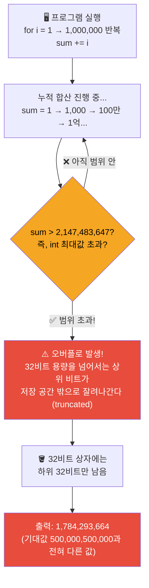
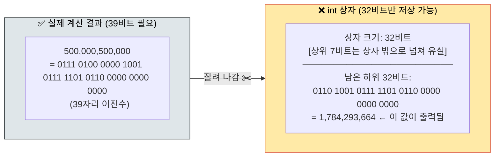
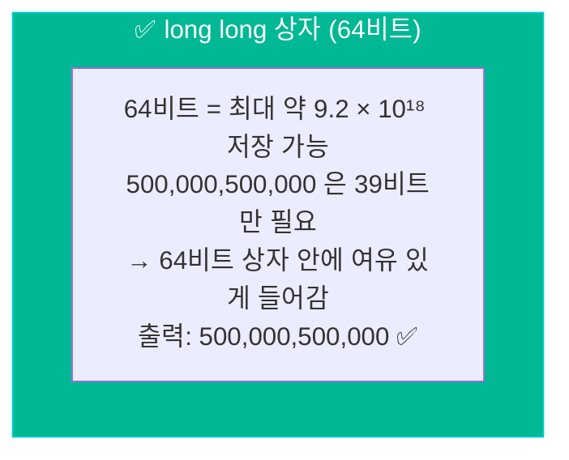

# 개발 일지 (Devlog) — 2026-09-29

## 📌 미니 STAR 1: 정수 타입 선택 미흡으로 인한 오버플로 발생

- **Situation (상황)**: 1부터 100만까지의 합을 구하는 프로그램 작성 중 합계 변수의 타입을 `int`로 변경하고 컴파일 및 실행함.
- **Task (목표)**: 기대 결과값인 `500,000,500,000`이 출력되는지 확인하고 정수 표현 범위를 이해함.
- **Action (수행)**: `int`로 실행했을 때 결과가 `1,784,293,664`로 엉뚱한 값이 나오는 이유를 분석함. 32비트 signed `int`의 최대 표현 범위인 $2,147,483,647$ ($2^{31}-1$)을 초과하여 상위 비트가 유실(Overflow)되는 현상임을 확인하고 `long long` (64비트 정수형)으로 복구함.
- **Result (결과)**: `long long` 사용 시 정확히 `500,000,500,000` 합계가 산출되는 것을 검증함.

> **💡 한 줄 인사이트**: 누적 계산 값이 21억($2^{31}-1$)을 넘을 가능성이 있는 모든 변수와 함수의 반환 타입은 반드시 `long long` 등 64비트 이상의 정수형을 써야 한다.

---

## 🔍 왜 오버플로가 발생하는가? — 비트 구조도

### 1. `int` vs `long long` 저장 공간 비교

### 2. `int` 오버플로 흐름 — 숫자가 범위를 넘을 때 일어나는 일

### 3. 비트 잘림(Truncation) 원리 — 비유로 이해하기

### 4. `long long`으로 고치면?

---

**📐 핵심 요약**

| 타입 | 비트 수 | 최대 표현 가능 값 | 1~100만 합 저장 가능? |
|---|---|---|---|
| `int` | 32비트 | 2,147,483,647 (≈21억) | ❌ 오버플로 |
| `long long` | 64비트 | 9,223,372,036,854,775,807 (≈920경) | ✅ 안전 |

> **결론**: `int` 상자는 32비트짜리 작은 통이다. 39비트가 필요한 큰 수를 억지로 담으려 하면, 넘치는 상위 비트는 잘려서 사라지고 하위 32비트만 남아 전혀 다른 수가 된다. `long long`은 64비트짜리 큰 통이라 여유 있게 담긴다.
